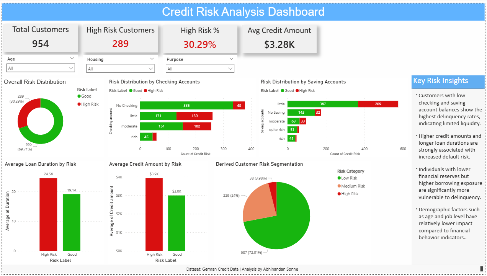
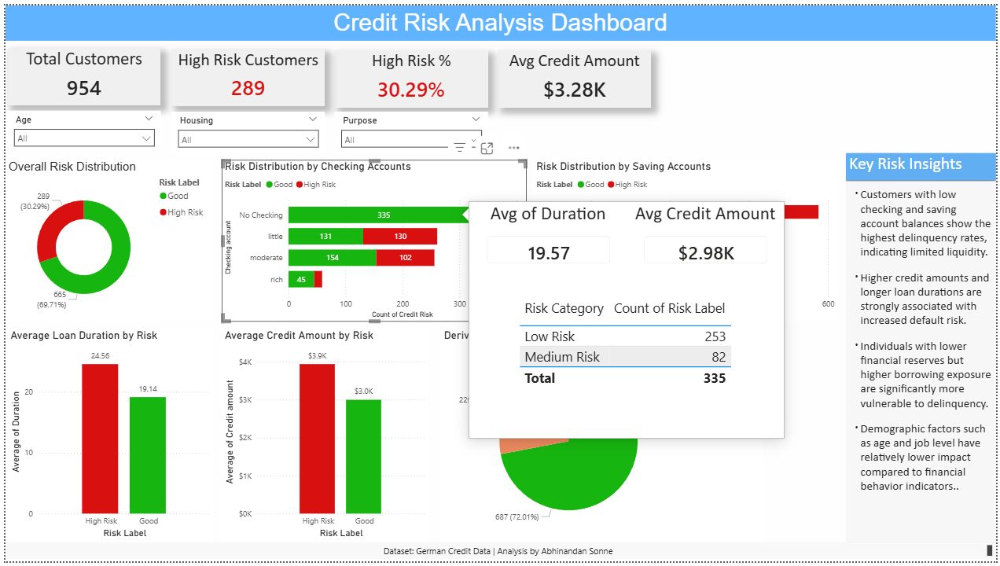

# 💳 Credit Risk Analysis & Risk Segmentation Dashboard

> **End-to-end data analyst project** - Python EDA · Power BI  
> Dataset: [German Credit Risk (UCI)](https://www.kaggle.com/datasets/uciml/german-credit) - 1,000 customers · Credit behavior & delinquency analysis

---

## 📌 Business Problem

A financial institution needs to assess the creditworthiness of its customers to minimize loan default risk. This project answers 4 core business questions:

- Which financial indicators are the strongest predictors of credit delinquency?
- How do liquidity levels and loan characteristics drive default probability?
- Which customer segments carry the highest credit risk?
- How can risk be visualized interactively to support business decision-making?

---

## 🧰 Tools & Technologies

| Tool | Purpose |
|---|---|
| **Python · pandas · NumPy** | Data cleaning and exploratory data analysis |
| **Excel** | Initial data preprocessing |
| **Power BI** | Interactive dashboard and risk segmentation |

---

## 📂 Project Structure

```
credit-risk-analysis-dashboard/
│
├── credit_data_cleaned.csv              ← Cleaned dataset (955 rows · 20 features)
├── credit_risk_analysis_EDA.ipynb       ← Full EDA notebook
├── Credit Risk Analysis Dashboard.pbix  ← Power BI dashboard file
├── dashboard_preview.png                ← Dashboard screenshot
├── tooltip_preview.png                  ← Tooltip drill-through preview
└── README.md
```

---

## 📊 Dashboard Preview

### Risk Segmentation Dashboard


---

## 🔍 Tooltip Preview


---

## 🔍 Key Findings

### Dataset Overview
| Metric | Value |
|---|---|
| Total customers | **1,000** |
| Features analyzed | **20** |
| Default rate | **30%** |
| Key risk drivers | Checking account · Credit amount · Duration |

### Risk by Liquidity
| Checking Account Status | Default Rate |
|---|---|
| No checking account | Lowest risk |
| Low balance (< 0 DM) | **Highest default rate** |
| Moderate balance (0–200 DM) | Elevated risk |
| High balance (> 200 DM) | Low risk |

### Loan Characteristics
- Higher **credit amounts** significantly increase default probability
- Longer **loan durations** are strongly associated with delinquency
- Customers with **high loan burden and low reserves** form the highest-risk segment

### Key Insight
> **Financial behavior indicators** (checking balance, savings, loan patterns) have a greater impact on predicting default than demographic attributes (age, housing, employment).

---

## 🔄 Project Workflow

1. **Data Cleaning & Preprocessing** - Python (pandas, NumPy) · handled missing values, encoded categoricals
2. **Exploratory Data Analysis** - distribution analysis, correlation heatmap, feature-by-feature risk profiling
3. **Feature Understanding & Pattern Identification** - ranked drivers of default risk
4. **Dashboard Development** - Power BI with interactive slicers, tooltips, and risk segments
5. **Insight Generation & Risk Segmentation** - High / Medium / Low classification

---

## 📊 Dashboard Features

- Interactive slicers (Age, Housing, Purpose) for dynamic filtering
- Risk segmentation into **High, Medium, and Low** categories
- Financial behavior analysis (Checking account, Saving account, Loan patterns)
- Tooltip-enabled detailed insights for drill-through interactivity

---

## 💡 Business Recommendations

1. **Flag low-liquidity applicants early** - customers with no or minimal checking/savings balance should trigger automatic risk review before loan approval
2. **Cap high-duration loans for borderline applicants** - loan duration is a strong delinquency signal; shorter repayment windows reduce portfolio exposure
3. **Introduce tiered credit limits** - high loan amounts combined with low reserves represent the highest-risk profile; limit initial credit for this segment
4. **Build proactive monitoring for High Risk customers** - intervene before default with restructuring offers or repayment plans
5. **Deprioritize demographic-only scoring** - financial behavior indicators outperform age and housing in predicting default; shift model weight accordingly

---

## 🚀 How to Reproduce

```bash
# 1. Clone the repository
git clone https://github.com/Abhisonne/credit-risk-analysis-dashboard.git

# 2. Run the EDA notebook
#    Open credit_risk_analysis_EDA.ipynb in Jupyter or Google Colab
#    The cleaned dataset (credit_data_cleaned.csv) is included - no download needed

# 3. Explore the dashboard
#    Open Credit Risk Analysis Dashboard.pbix in Power BI Desktop
```

---

## 🚀 Future Enhancements

- Integration of predictive modeling (logistic regression / gradient boosting)
- Deployment of dashboard for real-time data updates
- Expansion with larger and more diverse credit datasets

---

## 📬 Connect

**Abhinandan Sonne** - Data Analyst | Python · Power BI · Excel  
[LinkedIn](https://www.linkedin.com/in/abhinandan-sonne-b979431a4) · [GitHub](https://github.com/Abhisonne)

